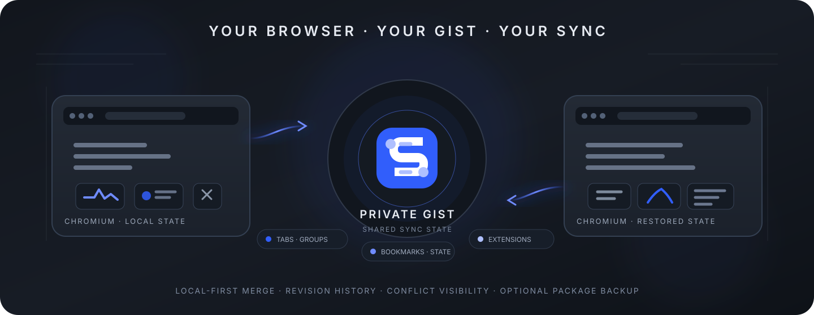

<div align="center">
  
</div>

<div align="center">
  <h1>Chromium Cloud Sync</h1>
  <p><strong>Sync your Chromium browser state through infrastructure you control.</strong></p>
  <p>Tabs · Tab Groups · Windows · Bookmarks · Extensions · Extension Settings</p>

  <p>
    <a href="https://github.com/CYoJkoY/ChromiumCloudSync/actions/workflows/release.yml"></a>
    <a href="https://github.com/CYoJkoY/ChromiumCloudSync/releases"></a>
    <a href="https://github.com/CYoJkoY/ChromiumCloudSync/releases"></a>
    <a href="LICENSE"></a>
    
    
  </p>
</div>

## Overview

**Chromium Cloud Sync** is a Manifest V3 Chromium extension for synchronizing browser state across machines without requiring a project-operated sync server.

The synchronization boundary is a **private GitHub Gist** owned by you. Chromium Cloud Sync keeps the local browser state locally, builds normalized snapshots, compares local and remote state against a stored base, and applies deterministic merge rules instead of blindly overwriting one side.

Alongside synchronization, the project can back up third-party extension packages (`.crx` / `.zip`) to a **private GitHub repository** or a **WebDAV** server. Package backup is intentionally separate from the browser-state synchronization Gist.

> **Security note:** the current synchronization format stores `current.json` as JSON in the configured private Gist. It is **not** end-to-end encrypted. Older releases used an encrypted format, and the repository retains a compatibility reader for that legacy data.

## Why Chromium Cloud Sync?

Most browser-sync solutions hide the storage and conflict model behind a service. This project takes a different approach:

- **Your storage boundary** — synchronization data lives in your GitHub Gist.
- **Local-first merging** — changes are compared against a local base snapshot before they are merged.
- **Inspectable history** — revisions, conflicts, tombstones, and rollback history remain visible.
- **Separate package backup** — extension binaries can be stored independently of the sync state.
- **No framework dependency** — the extension is implemented with native JavaScript, HTML, and CSS.

## Features

### Browser state synchronization

Synchronizes the browser data that is useful across multiple Chromium installations:

| Data | Behavior |
| :--- | :--- |
| Tabs & windows | Restores normal Chromium windows and HTTP(S) tabs. Restricted browser URLs are skipped. |
| Tab groups | Preserves title, color, collapsed state, and stable synchronization identity. |
| Bookmarks | Uses stable synchronization IDs rather than assuming local browser IDs are globally identical. |
| Extensions | Synchronizes installed third-party extension metadata and detects missing extensions. |
| Extension settings | Synchronizes extension-local storage while excluding Chromium Cloud Sync's own control state. |

### Deterministic merge and conflict handling

The core synchronization model is a three-way merge:

```text
                 ┌──────────────┐
                 │  Base state  │
                 └──────┬───────┘
                        │
              ┌─────────┴─────────┐
              ▼                   ▼
       ┌──────────────┐    ┌──────────────┐
       │ Local state  │    │ Remote state │
       └──────┬───────┘    └──────┬───────┘
              │                   │
              └─────────┬─────────┘
                        ▼
                ┌──────────────┐
                │ Merge policy │
                └──────┬───────┘
                       ▼
                ┌──────────────┐
                │ Merged state │
                └──────────────┘
```

The merge engine can distinguish local-only changes, remote-only changes, unchanged values, and real conflicts. Supported resolution strategies include field-level `latest`, `maxVersion`, and manual handling where appropriate.

Deleted entities are tracked with **tombstones**, preventing a deletion from silently being undone by a stale copy on another machine.

### History and rollback

Chromium Cloud Sync maintains a local revision index so you can inspect synchronization history and roll back to an earlier GitHub revision. The current implementation keeps up to **30** history entries locally.

### Extension package backup

Third-party extension packages can be backed up independently from the synchronization Gist:

```text
                    Chromium Cloud Sync
                              │
                ┌─────────────┴─────────────┐
                │                           │
         Browser-state sync         Package backup
                │                           │
          Private GitHub Gist       ┌────────┴────────┐
                                    │                 │
                              GitHub repository    WebDAV
```

The package backend tracks metadata such as extension ID, version, file name, format, byte size, SHA-256 hash, storage path, and timestamp. Browser-side GitHub package uploads are limited to **95 MB**.

### Localized and theme-aware UI

The extension includes:

- English and Simplified Chinese locales.
- Light and dark themes.
- Dedicated popup, settings, history, and user-guide pages.
- Reduced-motion support for theme transitions.

## Installation

### Install a release

Open the [Releases](https://github.com/CYoJkoY/ChromiumCloudSync/releases) page and download the package you need.

Each release is built as:

- `.zip` — unpacked extension package.
- `.crx` — signed CRX3 package.
- `SHA256SUMS.txt` — SHA-256 checksums for the release artifacts.

### Load the extension manually

For development or for using the ZIP package:

1. Open `chrome://extensions/` or your Chromium browser's equivalent extension-management page.
2. Enable **Developer mode**.
3. Select **Load unpacked**.
4. Choose the repository directory containing `manifest.json`.

## Initial setup

After installation, open **Chromium Cloud Sync → Settings** and configure the GitHub Gist backend.

```text
GitHub Token
     │
     ▼
Validate token
     │
     ├── Create a new private Gist
     │
     └── Bind an existing Gist
     │
     ▼
Synchronize
```

Automatic synchronization is disabled by default. The default interval is **5 minutes** once automatic synchronization is enabled.

> **Important:** treat your GitHub token as a credential. Use the minimum permissions required for the operations you need, and revoke or rotate it if it is exposed.

## Versioning and release channels

The repository separates stable releases from development builds.

`manifest.json` is the primary version source:

```json
{
  "version": "1.7.8",
  "version_name": "1.7.8.dev3"
}
```

The two fields have different roles:

| Field | Purpose |
| :--- | :--- |
| `version` | Stable Chrome extension version and the version copied to `package.json`. |
| `version_name` | Optional development build identifier in the form `X.Y.Z.devN`. |

This means the same manifest can represent both channels without deleting `version_name`:

```text
v1.7.8
└── stable release
    uses manifest.version

v1.7.8.dev3
└── development / pre-release
    uses manifest.version_name
```

`package.json.version` follows **only** `manifest.version`; development suffixes do not enter `package.json`.

The release workflow automatically marks `vX.Y.Z.devN` builds as GitHub **Pre-releases** while `vX.Y.Z` builds remain stable releases. The extension's normal update check uses GitHub's latest stable release endpoint, so development releases do not replace the stable update channel.

## Development

The project has no frontend framework and no runtime package dependencies. A recent Node.js installation is used for validation and release packaging.

### Validate

```bash
npm run validate
```

Validation checks the manifest version format, validates the development version name when present, verifies that `package.json.version` matches the stable manifest version, checks JavaScript syntax, verifies required source files, and performs project-specific integrity checks.

### Build the ZIP

```bash
npm run build:zip
```

A normal local build uses `manifest.version`. The release workflow supplies the exact stable or development release version explicitly so that a permanently retained `version_name` cannot accidentally change a stable build into a development build.

### Repository structure

```text
ChromiumCloudSync/
├── .github/
│   └── workflows/
│       └── release.yml
├── _locales/
│   ├── en/
│   └── zh_CN/
├── assets/
│   └── readme/
├── icons/
├── scripts/
│   ├── build.mjs
│   ├── sync-package-version.mjs
│   └── validate.mjs
├── background.js
├── extension-storage.js
├── extension-storage-layout.js
├── extension-storage-watch.js
├── guide.html
├── guide.js
├── history.html
├── history.js
├── i18n.js
├── legacy-crypto.js
├── manifest.json
├── options.html
├── options.js
├── package.json
├── popup.html
├── popup-i18n.js
├── popup.js
├── runtime.js
├── sync-core.js
├── theme.js
├── ui-overrides.css
├── ui.css
├── update.js
├── LICENSE
└── README.md
```

## Architecture

The extension is intentionally split into small native modules:

```text
Popup / Options / History / Guide
                │
                ▼
          Runtime + UI layer
                │
        ┌───────┴────────┐
        ▼                ▼
   Sync engine       Storage layer
   sync-core.js      extension-storage-*
        │                │
        └───────┬────────┘
                ▼
          GitHub Gist API
                │
                ▼
          current.json
```

The background worker coordinates browser APIs and synchronization. `sync-core.js` handles normalized state and merge behavior, while storage modules isolate extension-local persistence and package-backend concerns.

## Security and privacy

Chromium Cloud Sync is designed around user-controlled storage, but user-controlled storage does not automatically mean encrypted storage.

### What is currently true

- Synchronization data is stored in a configured private GitHub Gist.
- The current format uses JSON in `current.json`.
- The extension stores the GitHub token and Gist configuration in `chrome.storage.local`.
- Legacy encrypted Gist data can still be read for backward compatibility.
- SHA-256 hashes are used for package integrity metadata.

### What this project does not claim

- The current synchronization format is **not** end-to-end encrypted.
- A private Gist is not a substitute for client-side encryption.
- A checksum verifies data integrity; it does not establish trust or confidentiality.

Do not commit GitHub tokens, WebDAV passwords, private Gist contents, or CRX signing keys to this repository or issue tracker.

## Limitations

Chromium restrictions still apply. Browser-internal pages and other non-HTTP(S) URLs are not treated as ordinary synchronizable tabs. Extension package installation remains a manual browser action.

Synchronization also depends on the behavior and availability of the configured GitHub or WebDAV backend.

## Contributing

Issues and pull requests are welcome.

For a synchronization bug report, include the browser version, extension version, affected collection, whether the change occurred locally or remotely, and the visible conflict or error message. Never include credentials or private synchronization data.

For development changes, run `npm run validate` before submitting a pull request.

## License

This project is licensed under the **MIT License**.

See [`LICENSE`](LICENSE) for the complete license text.

## Support the Author

If this project saves you time or improves your workflow, consider supporting its development.

<div align="center">
  <a href="https://cyojkoy.github.io/Payment/">
    
  </a>
</div>

<div align="center">
  <sub>Built for users who want synchronized browser state without giving up control over where their data is stored.</sub>
</div>
