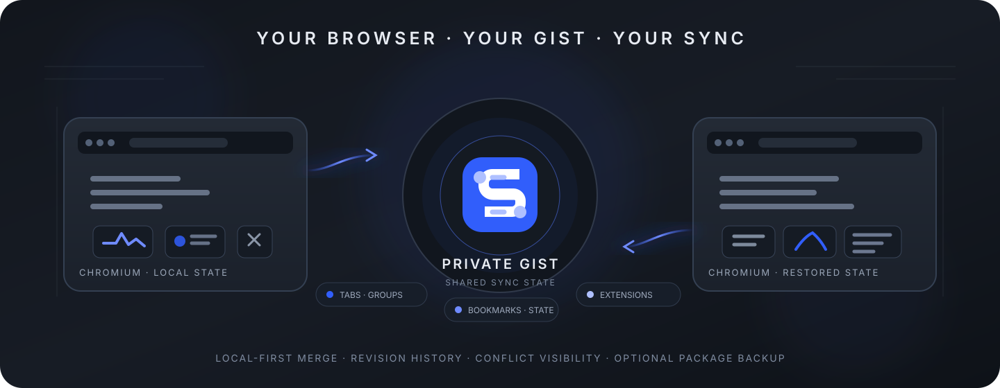
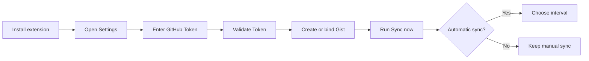

<div align="center">



# Chromium Cloud Sync

### Sync Chromium without handing your browser state to another sync backend.

<p>
  <a href="https://github.com/CYoJkoY/ChromiumCloudSync/releases/latest"></a>
  <a href="https://github.com/CYoJkoY/ChromiumCloudSync/stargazers"></a>
  <a href="https://github.com/CYoJkoY/ChromiumCloudSync/network/members"></a>
  <a href="https://github.com/CYoJkoY/ChromiumCloudSync/blob/main/LICENSE"></a>
  <a href="https://developer.chrome.com/docs/extensions/develop/concepts/manifest"></a>
</p>

<p>
  <a href="https://github.com/CYoJkoY/ChromiumCloudSync/releases/latest">Download</a>
  ·
  <a href="https://github.com/CYoJkoY/ChromiumCloudSync/wiki">Guide</a>
  ·
  <a href="https://github.com/CYoJkoY/ChromiumCloudSync/issues">Issues</a>
</p>

</div>

> [!IMPORTANT]
> **No project-owned synchronization server.** The extension communicates with GitHub directly. The shared sync state lives in a GitHub Gist, while the extension keeps its local base snapshot in browser storage.

---

## 📖 Overview

**Chromium Cloud Sync** is a Manifest V3 extension for synchronizing practical browser state between Chromium-based installations.

It is intentionally not a replacement for a full browser account system. Instead, it provides a small, inspectable synchronization layer with a clear storage boundary:

```text
Chromium A                    GitHub                    Chromium B
───────────                   ──────                    ─────────
local current ──────┐                                 ┌──── local current
                    │                                 │
local base ────────┼── read → merge → write ─────────┼── local base
                    │              │                  │
                    │              ▼                  │
                    └────── GitHub Gist ──────────────┘
                           manifest.json
                           current.json
                           native revisions
```

The repository deliberately avoids a device registry and per-device cloud database. Synchronization is based on one shared state plus a local base snapshot.

---

## ✨ Core Features

### 🗂️ Browser state synchronization

| Area | Current behavior |
| --- | --- |
| Tabs | URLs, titles, pinned state, active state, window state, tab-group metadata |
| Tab groups | Titles, colors, collapsed state |
| Bookmarks | Trees, titles, URLs, ordering, and mergeable local changes |
| Extensions | Installed extension inventory for comparison |
| Extension settings | Selected extension-local storage exposed through Chromium APIs |
| Sync metadata | Revisions, timestamps, tombstones, and conflict records |

> [!NOTE]
> Browser-internal and otherwise restricted URLs are filtered out rather than pretending they are synchronizable.

### 🔀 Base-aware conflict handling

The sync engine uses three meaningful snapshots:

```text
LOCAL BASE  +  LOCAL CURRENT  +  REMOTE CURRENT
                     │
                     ▼
                  MERGE
                     │
            ┌────────┴────────┐
            │                 │
       merged value      conflict record
            │                 │
            └────────┬────────┘
                     ▼
                new revision
```

Fields such as tab/bookmark URLs use stricter conflict handling, while metadata such as titles, pinned state, tab-group state, and extension versions have explicit merge policies. Unresolved conflicts are retained as records instead of being silently erased.

### 🕘 GitHub-native revision history

The project uses the Gist revision history rather than maintaining a second history database.

Rollback is non-destructive: the selected historical state is written back as a new revision, leaving the previous revisions intact.

### ⏱️ Automatic sync

Automatic synchronization is disabled by default.

| Setting | Default |
| --- | --- |
| Automatic sync | Off |
| Interval | 5 minutes |

The interval can be changed independently of the enabled state.

### 📦 Separate extension-package storage

Third-party extension package backups are intentionally outside the sync Gist.

The Settings page provides a dedicated **Extension Storage** area with three choices:

```text
Disabled

GitHub private repository
        or
WebDAV
```

Typical package layout:

```text
<storage root>/
└── extensions/
    └── <extension-id>/
        └── v<version>/
            ├── <package>.crx / <package>.zip
            └── metadata.json
```

GitHub package uploads use the Contents API and reject files above **95 MB** in the browser-side uploader. Git LFS is not implemented by the extension.

Package installation remains a user-controlled browser action.

---

## 🔐 Security & Privacy

### Direct-to-GitHub trust boundary

There is no project-operated sync backend sitting between the browser and GitHub.

The GitHub API/Gist service is therefore the remote trust boundary for synchronization.

### Private Gists by default

When the extension creates a new synchronization Gist, it requests private visibility. Existing Gists retain their existing visibility and access rules.

### Plain JSON synchronization

The current synchronization path stores the shared state as ordinary JSON.

There is **no application-layer encryption in the current format**. The repository still contains compatibility-only code for reading older encrypted synchronization data so legacy users can migrate forward.

> [!WARNING]
> **Anyone with access to the synchronization Gist can access the synchronized state.**

### Local credentials and signing material

The GitHub Token is stored locally by the extension and used for authenticated GitHub API requests.

Never commit tokens, private keys, signing material, personal Gist contents, or private extension-backup credentials.

---

## ⚙️ How synchronization works

At a high level, a synchronization run follows this sequence:

```text
1. Collect browser state
          ↓
2. Load local base snapshot
          ↓
3. Read current Gist state
          ↓
4. Merge local + remote changes
          ↓
5. Apply tombstones / retain conflict records
          ↓
6. Write manifest.json + current.json
          ↓
7. GitHub creates a new Gist revision
          ↓
8. Save merged state as the new local base
```

The sync core uses stable locally persisted identifiers for browser objects. These local IDs are deliberately separated from the shared state identity model.

---

## 🧠 Implementation Highlights

### Stable browser-object identity

Tabs, windows, tab groups, and bookmarks receive locally persisted synchronization identifiers. This prevents short-lived Chromium runtime IDs from becoming the cloud identity of a browser object.

### Explicit merge policies

The sync engine contains collection-specific policies rather than treating every field as an opaque blob:

| Collection | Examples of policy |
| --- | --- |
| Tabs | Latest metadata, conflict on URL changes |
| Bookmarks | Latest metadata/order, conflict on URL changes |
| Extensions | Latest enabled/install metadata, highest version wins |
| Tab groups | Latest title/color/collapsed state |
| Windows | Live-state preference when both sides diverge |

### Tombstones

Deleted objects can be represented by tombstones so a deletion is not accidentally recreated by another synchronization pass.

### Legacy migration

Older encrypted Gists remain readable through compatibility-only code. Current writes use the plain JSON format and clean up obsolete device/encryption state during migration.

---

## 📄 Sync Data Model

The current Gist payload is intentionally small:

```text
manifest.json
current.json
```

`manifest.json` describes the sync format, current revision, and update metadata.

`current.json` contains the current shared synchronization state, including synchronized collections, tombstones, and conflict information.

Historical states are supplied by GitHub Gist revisions rather than separate `history/*` files.

---

## 🕘 History & Rollback

Rollback does not rewrite the past:

```text
GitHub revision
      │
      ▼
selected historical state
      │
      ▼
write current state
      │
      ▼
new GitHub revision
```

This provides a recovery path while retaining the original revision history.

---

## 🚀 Installation

### Recommended: GitHub Release

<a href="https://github.com/CYoJkoY/ChromiumCloudSync/releases/latest"></a>

Release artifacts contain:

- distributable ZIP
- signed CRX3 package
- SHA-256 checksums

For a standard manual installation:

```text
1. Download the release ZIP
2. Extract the archive
3. Open chrome://extensions/
4. Enable Developer mode
5. Choose Load unpacked
6. Select the extracted directory
```

The CRX exists for environments that accept CRX packages. Chromium installation policy varies by browser and environment; the project does not claim silent self-installation or silent replacement of an installed extension.

### Build from source

```bash
git clone https://github.com/CYoJkoY/ChromiumCloudSync.git
cd ChromiumCloudSync
npm run validate
npm run build:zip
```

Then load the repository directory through **Load unpacked**.

---

## 🔧 First-time setup



New synchronization Gists created by the extension are private by default.

---

## 🔄 Updates & Releases

The extension checks the repository's latest GitHub Release and can notify the user when a newer version is available.

The release workflow is tag-driven:

```text
git tag vX.Y.Z
      │
      ▼
validate project
      │
      ├── build ZIP
      ├── verify ZIP contents
      ├── build signed CRX3
      ├── generate SHA256SUMS.txt
      └── publish GitHub Release
```

The release workflow validates that the Git tag version matches `manifest.json`, builds with Node.js 24, and uses the repository secret `CRX_PRIVATE_KEY_B64` for stable CRX signing.

---

## 🌐 Browser Compatibility

Chromium Cloud Sync targets Chromium-based browsers that support Manifest V3 and the APIs used by the extension.

Compatibility can differ around extension-management policy, restricted URLs, tab groups, and CRX installation. The extension therefore treats browser-policy differences as platform constraints rather than assuming every Chromium distribution behaves identically.

---

## ⚠️ Known Limitations

| Limitation | Impact |
| --- | --- |
| Restricted browser pages | Many `chrome://` and non-HTTP(S) URLs cannot be synchronized |
| Extension settings | Only storage exposed to the extension can be collected |
| Missing extensions | Detected for comparison, never silently installed |
| Plain JSON | Gist access must be treated as access to synchronized data |
| GitHub dependency | Gist sync requires GitHub availability |
| Package size | Browser-side GitHub package uploads above 95 MB are rejected |
| Installation policy | Browser controls whether CRX installation/update is permitted |

---

## 📁 Project Structure

```tree
ChromiumCloudSync/
├── 📁 .github/
│   └── 📁 workflows/
│       └── ⚙️ release.yml
├── 📁 _locales/
│   ├── 📁 en/
│   │   └── 📄 messages.json
│   └── 📁 zh_CN/
│       └── 📄 messages.json
├── 📁 assets/
│   └── 📁 readme/
│       └── 🖼️ hero.svg
├── 📁 icons/
│   ├── 🖼️ icon16.png
│   ├── 🖼️ icon32.png
│   ├── 🖼️ icon48.png
│   ├── 🖼️ icon128.png
│   ├── 🖼️ icon256.png
│   ├── 🖼️ icon512.png
│   └── 🎨 icon.svg
├── 📄 background.js
├── 📄 sync-core.js
├── 📄 legacy-crypto.js
├── 📄 extension-storage.js
├── 📄 extension-storage-layout.js
├── 📄 extension-storage-watch.js
├── 📄 update.js
├── 📄 runtime.js
├── 📄 i18n.js
├── 📄 theme.js
├── 📄 popup.html
├── 📄 popup.js
├── 📄 popup-i18n.js
├── 📄 options.html
├── 📄 options.js
├── 📄 history.html
├── 📄 history.js
├── 📄 guide.html
├── 📄 guide.js
├── 🎨 ui.css
├── 🎨 ui-overrides.css
├── ⚙️ manifest.json
├── ⚙️ package.json
└── 📁 scripts/
    ├── 📄 build.mjs
    └── 📄 validate.mjs
```

---

## 🛠️ Development

### Requirements

- Node.js 24+
- Chromium-based browser with Manifest V3 support

### Validate

```bash
npm run validate
```

### Build

```bash
npm run build:zip
```

The build script reads the extension version directly from `manifest.json` and produces the release ZIP under `dist/`.

---

## 🤝 Contributing

Issues and pull requests are welcome.

Before submitting a change:

1. Keep the synchronization model small and understandable.
2. Preserve migration paths when changing the Gist schema.
3. Keep extension permissions aligned with actual feature usage.
4. Never commit credentials, private synchronization data, or signing keys.
5. Update this README when a user-visible architectural decision changes.

---

## 💰 Support the Author

If Chromium Cloud Sync is useful to you, consider supporting the project.

<div align="center">

<a href="https://cyojkoy.github.io/Payment/">
  
</a>

</div>

---

## 📜 License

Chromium Cloud Sync is free software licensed under the **GNU General Public License v3.0 only (GPL-3.0-only)**.

<a href="https://www.gnu.org/licenses/gpl-3.0.html"></a>

See [LICENSE](LICENSE) for the complete project license text.

<div align="center">

<sub>Chromium Cloud Sync · browser state synchronization through GitHub Gist</sub>

</div>
