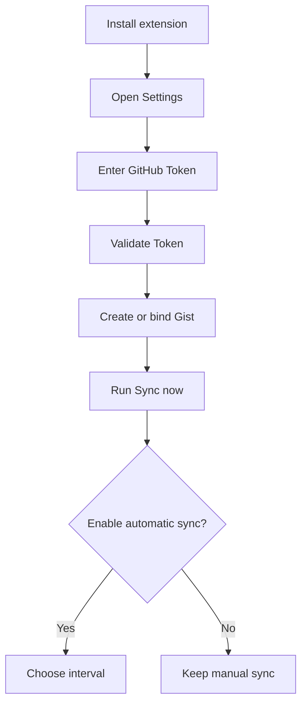

<div align="center">


# Chromium Cloud Sync

### Your browser state. Your GitHub Gist. No sync server in the middle.

<p>
  <a href="https://github.com/CYoJkoY/ChromiumCloudSync/releases/latest"></a>
  <a href="https://github.com/CYoJkoY/ChromiumCloudSync/stargazers"></a>
  <a href="https://github.com/CYoJkoY/ChromiumCloudSync/network/members"></a>
  <a href="https://github.com/CYoJkoY/ChromiumCloudSync/blob/main/LICENSE"></a>
  <a href="https://developer.chrome.com/docs/extensions/develop/concepts/manifest"></a>
</p>

<p>
  <a href="https://github.com/CYoJkoY/ChromiumCloudSync/releases">Download</a>
  ·
  <a href="https://github.com/CYoJkoY/ChromiumCloudSync/issues">Issues</a>
  ·
  <a href="https://github.com/CYoJkoY/ChromiumCloudSync/wiki">Wiki</a>
</p>

</div>

> [!IMPORTANT]
> **Chromium Cloud Sync does not operate a project-owned synchronization server.** The extension communicates directly with GitHub and stores the shared synchronization state in your Gist.

---

## 📖 Overview

**Chromium Cloud Sync** is a lightweight Manifest V3 extension for synchronizing useful browser state between Chromium-based installations.

The project is deliberately built around a small trust boundary:

```text
┌──────────────────┐
│   Chromium A     │
│ local base       │
│ snapshot         │
└────────┬─────────┘
         │
         │ read / merge / write
         ▼
┌────────────────────────────┐
│        GitHub Gist          │
│                            │
│  manifest.json             │
│  current.json              │
│  native revisions          │
└────────────┬───────────────┘
             │
             │ read / merge / write
             ▼
┌──────────────────┐
│   Chromium B     │
│ local base       │
│ snapshot         │
└──────────────────┘
```

There is **one shared synchronization state**. The project does not maintain a device registry or a per-device cloud database.

---

## ✨ Core Features

### ☁️ GitHub Gist synchronization

Your synchronized browser state lives in a GitHub Gist instead of a backend operated by this project.

| Area | Synchronized data |
| --- | --- |
| 🗂️ Tabs | URLs, titles, pinned state, active state, window state, tab-group metadata |
| 🏷️ Tab groups | Names, colors, collapsed state |
| 🔖 Bookmarks | Bookmark trees, titles, URLs, ordering, local-tree merging |
| 🧩 Extensions | Installed extension inventory for comparison |
| ⚙️ Extension settings | Selected extension-local storage exposed through Chromium APIs |
| 🧾 Sync metadata | Revision metadata, timestamps, tombstones, conflict records |

> [!NOTE]
> Restricted pages such as many `chrome://` URLs are not synchronizable because Chromium does not expose them through the normal tab APIs used by the extension.

### 🔀 Conflict-aware merging

Synchronization is not a blind **last-write-wins** upload.

```text
                    Local base
                   /          \
                  /            \
       Local current          Remote current
                  \            /
                   \          /
                    ── Merge ──
                         │
                ┌────────┴────────┐
                │                 │
          Merged state      Conflict record
                │
                ▼
          New Gist revision
```

The extension keeps a local base snapshot so it can distinguish local changes from remote changes and preserve unresolved differences as explicit conflict records.

### 🕘 GitHub-native history

The Gist's own revision system is the history layer.

There is no custom `history/*` database. Rollback is non-destructive: the selected historical state is written as a **new revision**, so previous revisions remain available.

### ⏱️ Automatic synchronization

Automatic synchronization is **off by default**.

| Setting | Default |
| --- | --- |
| Automatic sync | Disabled |
| Interval | 5 minutes |

The interval can be changed independently from the enabled/disabled state.

### 📦 Third-party extension package storage

Browser synchronization and extension-package backup are separate systems.

CRX/ZIP packages are **not written into the synchronization Gist**. Open **Settings → Extension Storage** and choose:

```text
Disabled

GitHub private repository
        or
WebDAV
```

Typical storage layout:

```text
<storage-root>/
└── extensions/
    └── <extension-id>/
        └── v<version>/
            ├── package.crx / package.zip
            └── metadata.json
```

GitHub package uploads currently use the browser-side Contents API. Files above **95 MB** are rejected; Git LFS is not implemented by the extension.

Package installation remains a user-controlled browser action.

---

## 🔐 Security & Privacy

### No project-owned backend

The extension talks directly to GitHub. This project does not operate an intermediate server that receives your synchronized browser state.

### Private Gists by default

New synchronization Gists created by the extension request private visibility. Existing Gists retain their existing visibility and access rules.

### Plain JSON by design

The current synchronization payload uses normal JSON. There is no application-layer encryption in the current synchronization path.

This is deliberate: the format remains inspectable, and there is no additional encryption-key recovery protocol to maintain.

> [!WARNING]
> **Treat access to the synchronization Gist as access to the synchronized browser state.**

Older encrypted Gists remain readable through compatibility-only migration code so existing users can move to the current format.

### Token handling

The GitHub Token is stored locally in the extension and used for authenticated API requests.

Never commit:

- GitHub tokens
- CRX signing keys
- PEM/private-key files
- personal Gist contents
- private extension-backup credentials

---

## 🚀 Installation & Setup

### Download a release

Get the latest release from:

**https://github.com/CYoJkoY/ChromiumCloudSync/releases/latest**

Release artifacts include the distributable ZIP, a signed CRX3 package, and SHA-256 checksums.

### Install manually

```text
1. Download the release ZIP
2. Extract it
3. Open chrome://extensions/
4. Enable Developer mode
5. Choose Load unpacked
6. Select the extracted directory
```

The CRX is available for environments that accept CRX packages. Chromium installation policies differ by browser and environment, so this project does **not** claim silent self-installation or silent replacement of an installed extension.

### First-time setup



New synchronization Gists created by the extension are private by default.

---

## 🧠 Implementation Highlights

### Local base snapshots

Each installation keeps a local synchronization base. A sync operation compares:

```text
Local Base
Local Current
Remote Current
```

That structure provides enough information to merge concurrent edits rather than replacing remote state unconditionally.

### Stable local object mapping

Tabs, windows, tab groups, and bookmarks use locally persisted sync identifiers to preserve object identity between synchronization runs.

The project intentionally separates **local Chromium IDs** from the synchronization state written to GitHub.

### Compatibility-first migrations

The repository still contains a compatibility-only reader for older encrypted synchronization data. Current synchronization uses the new plain-JSON state format, while legacy data remains readable long enough to migrate forward.

### Minimal dependency surface

The extension uses native browser APIs and plain JavaScript rather than a large frontend runtime.

---

## 📄 Data Model

The current synchronization Gist contains two files:

```text
manifest.json
current.json
```

`manifest.json` describes synchronization format and revision metadata.

`current.json` contains the current shared browser state, including synchronized collections and sync metadata.

Historical states come from GitHub Gist revisions rather than from additional history files maintained by the extension.

---

## 🕘 History & Rollback

Rollback is intentionally non-destructive:

```text
Historical Gist revision
          │
          ▼
    Selected state
          │
          ▼
Write as a new revision
          │
          ▼
Existing history preserved
```

This gives the project a recovery path without introducing a separate history database.

---

## 🔄 Updates & Releases

The extension checks the repository's latest GitHub Release and can notify the user when a newer version is available.

Release builds are driven by semantic version tags:

```text
git tag vX.Y.Z
      │
      ▼
GitHub Actions
      │
      ├── validate
      ├── build ZIP
      ├── build signed CRX3
      ├── generate SHA-256 checksums
      └── publish GitHub Release
```

The CRX signing key is supplied through the GitHub Actions secret:

```text
CRX_PRIVATE_KEY_B64
```

The signing key must remain stable across releases so the extension keeps the same cryptographic identity.

---

## 🌐 Browser Compatibility

Chromium Cloud Sync targets Chromium-based browsers supporting Manifest V3 and the APIs used by the extension.

Behavior can differ across Chrome, Chromium, Edge, and other Chromium distributions, particularly around extension-management policies, restricted URLs, tab groups, and CRX installation rules.

---

## ⚠️ Known Limitations

- Restricted pages such as many `chrome://` URLs cannot be synchronized.
- Extension settings are limited to storage exposed to this extension.
- Missing extensions are detected rather than silently installed.
- GitHub availability and Gist behavior are external dependencies.
- Plain JSON means Gist access is equivalent to access to the synchronized state.
- Browser-side GitHub package uploads are limited to 95 MB per file.
- Browser extension installation policies remain outside the extension's control.

---

## 🛠️ Development

### Requirements

- Node.js 24+
- A Chromium-based browser with Manifest V3 support

### Validate

```bash
npm run validate
```

### Build

```bash
npm run build:zip
```

The build reads the package version directly from `manifest.json`.

---

## 📁 Project Structure

```tree
ChromiumCloudSync/
├── 📁 .github/workflows/
│   └── ⚙️ release.yml
├── 📁 _locales/
├── 📁 icons/
├── 📄 background.js
├── 📄 sync-core.js
├── 📄 legacy-crypto.js
├── 📄 update.js
├── 📄 runtime.js
├── 📄 i18n.js
├── 📄 theme.js
├── 📄 extension-storage.js
├── 📄 extension-storage-layout.js
├── 📄 extension-storage-watch.js
├── 📄 popup.html
├── 📄 popup.js
├── 📄 popup-i18n.js
├── 📄 options.html
├── 📄 options.js
├── 📄 history.html
├── 📄 history.js
├── 📄 guide.html
├── 📄 guide.js
├── 🎨 ui.css
├── 🎨 ui-overrides.css
├── ⚙️ manifest.json
└── 📁 scripts/
    ├── 📄 build.mjs
    └── 📄 validate.mjs
```

---

## 🎯 Design Philosophy

> **One shared state.**  
> **Local base snapshots.**  
> **Explicit conflicts.**  
> **Native GitHub history.**  
> **Separate package storage.**  
> **User-controlled installation.**

The project is intentionally not a browser cloud platform. It is a small synchronization layer designed to keep the storage path, failure modes, and recovery model understandable.

---

## 🤝 Contributing

Issues and pull requests are welcome.

Before submitting a change:

1. Keep the synchronization model understandable.
2. Preserve migration paths when changing the Gist schema.
3. Keep extension permissions aligned with actual feature usage.
4. Never commit credentials, personal Gist data, or signing keys.
5. Update this README when a user-visible architecture decision changes.

---

## 💰 Support the Author

If this project is useful to you, consider buying the author a coffee ☕

<div align="center">

<a href="https://cyojkoy.github.io/Payment/">
  
</a>

</div>

---

## 📄 License

Chromium Cloud Sync is free software licensed under the **GNU General Public License v3.0 only (GPL-3.0-only)**.

<a href="LICENSE"></a>

See [LICENSE](LICENSE) for the full license text.

<div align="center">

<sub>Chromium Cloud Sync · GitHub-backed Chromium synchronization</sub>

</div>
