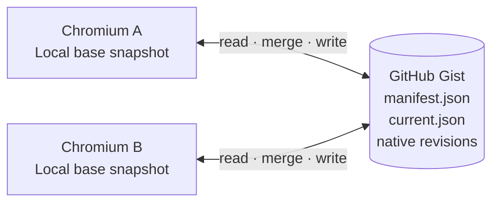
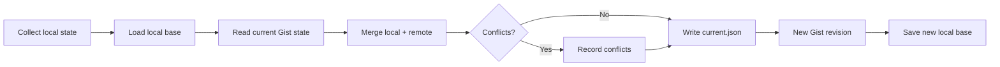
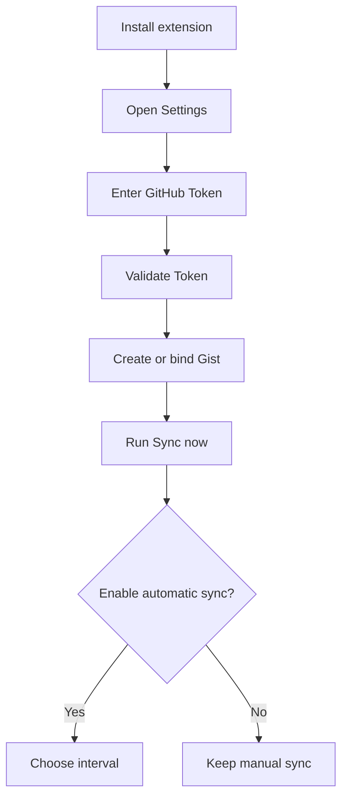

<div align="center">


<p>
  <a href="https://github.com/CYoJkoY/ChromiumCloudSync/releases/latest"></a>
  <a href="https://github.com/CYoJkoY/ChromiumCloudSync/stargazers"></a>
  <a href="https://github.com/CYoJkoY/ChromiumCloudSync/network/members"></a>
  <a href="https://github.com/CYoJkoY/ChromiumCloudSync/blob/main/LICENSE"></a>
  <a href="https://developer.chrome.com/docs/extensions/develop/concepts/manifest"></a>
</p>

<p>
  <a href="https://github.com/CYoJkoY/ChromiumCloudSync/releases/latest">Download</a>
  ·
  <a href="https://github.com/CYoJkoY/ChromiumCloudSync/issues">Issues</a>
  ·
  <a href="https://github.com/CYoJkoY/ChromiumCloudSync/wiki">Wiki</a>
</p>

</div>

> [!IMPORTANT]
> **No project-owned sync server.** Chromium Cloud Sync communicates directly with GitHub and stores the shared synchronization state in a GitHub Gist.

---

## 📖 Overview

**Chromium Cloud Sync** is a lightweight Manifest V3 extension for synchronizing useful browser state across Chromium-based installations.

The core idea is intentionally simple: each browser keeps a local base snapshot, reads the current shared state from GitHub Gist, merges local and remote changes, and writes the result back as a new revision.



There is **no device registry**, no per-device cloud database, and no synchronization server operated by this project.

---

## ✨ What makes it different?

<table>
<tr>
<td width="50%">

### Your storage boundary

Your synchronized state is stored in **your GitHub Gist**, not in a project-operated backend.

</td>
<td width="50%">

### Native history

GitHub Gist revisions provide the history layer. Rollback creates a new revision instead of rewriting the past.

</td>
</tr>
<tr>
<td>

### Explicit conflicts

The extension uses a local base snapshot so concurrent changes can be merged and unresolved differences can be surfaced as conflict records.

</td>
<td>

### Small architecture

Native browser APIs, plain JavaScript, Manifest V3, and a minimal remote data model keep the moving parts understandable.

</td>
</tr>
</table>

---

## 🚀 Core Features

### 🗂️ Browser state synchronization

| Area | What is synchronized |
| --- | --- |
| Tabs | URLs, titles, pinned state, active state, window state, tab-group metadata |
| Tab groups | Names, colors, collapsed state |
| Bookmarks | Trees, titles, URLs, ordering, local-tree merging |
| Extensions | Installed extension inventory for comparison |
| Extension settings | Selected storage exposed through Chromium extension storage APIs |
| Sync metadata | Revision metadata, timestamps, tombstones, conflict records |

> [!NOTE]
> Many restricted pages such as `chrome://` URLs cannot be synchronized because Chromium does not expose them through the normal tab APIs used by the extension.

### 🔀 Conflict-aware merging

Synchronization is **not** a blind last-write-wins upload.

```text
                       Local base
                     /            \
                    /              \
           Local current        Remote current
                    \              /
                     \            /
                      ── merge ──
                           │
                  ┌────────┴────────┐
                  │                 │
            Merged state      Conflict record
                  │
                  ▼
             New Gist revision
```

The local base snapshot gives the extension enough information to distinguish changes made locally from changes made remotely before producing the next shared state.

### 🕘 GitHub-native history

The synchronization history comes directly from GitHub Gist revisions.

There is no custom `history/*` database. A rollback takes a selected historical state and writes it as a **new revision**, preserving existing history.

### ⏱️ Automatic synchronization

Automatic synchronization is **disabled by default**.

| Setting | Default |
| --- | --- |
| Automatic sync | Off |
| Interval | 5 minutes |

The interval can be changed independently of the enabled state.

### 📦 Third-party extension package storage

CRX/ZIP backups are deliberately kept separate from the synchronization Gist.

Open **Settings → Extension Storage** and choose:

```text
Disabled

GitHub private repository
        or
WebDAV
```

Typical layout:

```text
<storage-root>/
└── extensions/
    └── <extension-id>/
        └── v<version>/
            ├── package.crx / package.zip
            └── metadata.json
```

GitHub package uploads use the browser-side Contents API. Files above **95 MB** are rejected; Git LFS is not implemented by the extension.

> [!NOTE]
> Package installation is always a user-controlled browser action. The extension does not silently install missing third-party extensions.

---

## 🔐 Security & Privacy

### Direct-to-GitHub architecture

The extension talks directly to GitHub. This repository does not operate an intermediate synchronization service that receives your browser state.

### Private Gists by default

New synchronization Gists created by the extension request private visibility. Existing Gists retain their own visibility and access rules.

### Plain JSON by design

The current synchronization payload is stored as normal JSON. There is no application-layer encryption in the current synchronization path.

This keeps the data model inspectable and avoids a separate encryption-key recovery protocol.

> [!WARNING]
> **Treat access to the synchronization Gist as access to the synchronized browser state.**

Older encrypted Gists remain readable through compatibility-only migration code so existing data can be migrated forward.

### Token handling

The GitHub Token is stored locally in the extension and is used for authenticated GitHub API requests.

Never commit:

- GitHub tokens
- CRX signing keys
- PEM/private-key files
- personal Gist contents
- private extension-backup credentials

---

## 🧩 How synchronization works



The two important local concepts are the **current state** and the **base snapshot**. The base is what allows the extension to reason about concurrent changes instead of simply replacing the remote state with whatever the latest browser happens to contain.

---

## 🕘 History & Rollback

Rollback is intentionally non-destructive:

```text
Historical Gist revision
          │
          ▼
     Selected state
          │
          ▼
    Write as new revision
          │
          ▼
     History preserved
```

GitHub's existing revisions remain intact.

---

## 🚀 Installation

### GitHub Release

Download the latest release:

<a href="https://github.com/CYoJkoY/ChromiumCloudSync/releases/latest"></a>

Release artifacts include the distributable ZIP, a signed CRX3 package, and SHA-256 checksums.

### Manual installation

```text
1. Download the release ZIP
2. Extract it
3. Open chrome://extensions/
4. Enable Developer mode
5. Choose Load unpacked
6. Select the extracted directory
```

The CRX is available for environments that accept CRX packages. Chromium installation policies vary by browser and environment, so the project does **not** claim silent self-installation or silent replacement of an installed extension.

### Build from source

```bash
git clone https://github.com/CYoJkoY/ChromiumCloudSync.git
cd ChromiumCloudSync
npm run validate
npm run build:zip
```

Then load the repository directory through **Load unpacked**.

---

## ⚙️ First-time setup



New Gists created by the extension are private by default.

---

## 🔄 Updates & Releases

The extension checks the repository's latest GitHub Release and can notify the user when a newer version is available.

Release builds are driven by semantic version tags:

```text
git tag vX.Y.Z
      │
      ▼
GitHub Actions
      │
      ├── validate
      ├── build ZIP
      ├── build signed CRX3
      ├── generate SHA-256 checksums
      └── publish GitHub Release
```

The CRX signing key is supplied through the GitHub Actions secret:

```text
CRX_PRIVATE_KEY_B64
```

The signing key must remain stable across releases so the extension keeps the same cryptographic identity.

---

## 🌐 Browser Compatibility

Chromium Cloud Sync targets Chromium-based browsers supporting Manifest V3 and the APIs used by the extension.

Behavior can differ across Chrome, Chromium, Edge, and other Chromium distributions, especially around extension-management policies, restricted URLs, tab groups, and CRX installation rules.

---

## ⚠️ Known Limitations

> [!WARNING]
> Synchronization depends on GitHub availability and on the browser exposing the relevant Chromium APIs.

| Limitation | Consequence |
| --- | --- |
| Restricted URLs | Some browser-internal pages cannot be synchronized |
| Extension settings | Only storage exposed to this extension can be collected |
| Missing extensions | Detected, but not silently installed |
| GitHub dependency | Sync and package storage depend on GitHub availability where configured |
| Plain JSON | Gist access should be treated as access to synchronized state |
| 95 MB package limit | Browser-side GitHub package uploads above 95 MB are rejected |

---

## 🧠 Implementation Highlights

**Stable local object identity.** Tabs, windows, tab groups, and bookmarks use locally persisted synchronization identifiers so local browser IDs do not become the shared cloud identity.

**Compatibility-first migration.** The repository retains a compatibility-only reader for legacy encrypted synchronization data while current synchronization uses the plain JSON state model.

**Separate storage planes.** Browser synchronization remains in the Gist, while third-party extension package binaries use the independent GitHub-private-repository/WebDAV storage subsystem.

**Minimal dependency surface.** The extension uses native browser APIs and plain JavaScript rather than a large frontend framework.

---

## 📄 Data Model

The current synchronization Gist is deliberately small:

```text
manifest.json
current.json
```

`manifest.json` describes the synchronization format and revision metadata.

`current.json` contains the current shared browser state, synchronized collections, and synchronization metadata.

Historical states come from native Gist revisions rather than from additional history files.

---

## 📁 Project Structure

```text
ChromiumCloudSync/
├── 📁 .github/workflows/
│   └── ⚙️ release.yml
├── 📁 _locales/
├── 📁 icons/
├── 📄 background.js
├── 📄 sync-core.js
├── 📄 legacy-crypto.js
├── 📄 update.js
├── 📄 runtime.js
├── 📄 i18n.js
├── 📄 theme.js
├── 📄 extension-storage.js
├── 📄 extension-storage-layout.js
├── 📄 extension-storage-watch.js
├── 📄 popup.html
├── 📄 popup.js
├── 📄 popup-i18n.js
├── 📄 options.html
├── 📄 options.js
├── 📄 history.html
├── 📄 history.js
├── 📄 guide.html
├── 📄 guide.js
├── 🎨 ui.css
├── 🎨 ui-overrides.css
├── 📄 manifest.json
└── 📁 scripts/
    ├── 📄 build.mjs
    └── 📄 validate.mjs
```

---

## 🛠️ Development

### Requirements

- Node.js 24+
- A Chromium-based browser with Manifest V3 support

### Validate

```bash
npm run validate
```

### Build

```bash
npm run build:zip
```

The build reads the package version directly from `manifest.json`.

---

## 🤝 Contributing

Issues and pull requests are welcome.

When changing the project:

1. Keep the synchronization model understandable.
2. Preserve migration paths when changing the Gist schema.
3. Keep extension permissions aligned with actual feature usage.
4. Never commit credentials, personal Gist data, or signing keys.
5. Update this README when a user-visible architecture decision changes.

---

## 💰 Support the Author

<div align="center">

<a href="https://cyojkoy.github.io/Payment/">
  
</a>

</div>

---

## 📜 License

Chromium Cloud Sync is free software licensed under the **GNU General Public License v3.0 only (GPL-3.0-only)**.

<a href="https://www.gnu.org/licenses/gpl-3.0.html"></a>

See [LICENSE](LICENSE) for the complete project license text.

<div align="center">

<sub>Chromium Cloud Sync · GitHub-backed browser synchronization</sub>

</div>
