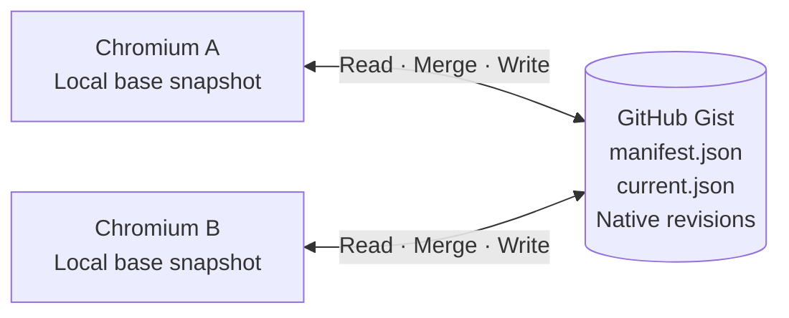
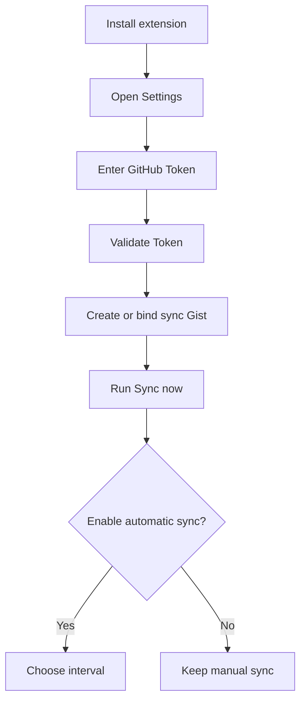

<div align="center">


# Chromium Cloud Sync

### Your Chromium data. Your GitHub Gist. Your control.

<p>
  <a href="https://github.com/CYoJkoY/ChromiumCloudSync/releases/latest"></a>
  <a href="https://github.com/CYoJkoY/ChromiumCloudSync/stargazers"></a>
  <a href="https://github.com/CYoJkoY/ChromiumCloudSync/network/members"></a>
  <a href="LICENSE"></a>
</p>

<p>
  <a href="https://github.com/CYoJkoY/ChromiumCloudSync/releases">Downloads</a>
  ·
  <a href="https://github.com/CYoJkoY/ChromiumCloudSync/issues">Issues</a>
  ·
  <a href="https://github.com/CYoJkoY/ChromiumCloudSync/wiki">Wiki</a>
</p>

</div>

> [!IMPORTANT]
> Chromium Cloud Sync does **not** run a project-owned synchronization server. Your synchronization data is stored in GitHub Gist and accessed directly through the GitHub API.

---

## What is this?

Chromium Cloud Sync is a **Manifest V3** extension for synchronizing useful browser state between Chromium-based installations without introducing another hosted synchronization service.

The architecture is intentionally small:



The extension keeps a local base snapshot, reads the current shared state, merges changes, and writes the resulting state back to the same Gist as a new revision.

There is **no device registry** and no per-device cloud database.

## Why this architecture?

| | Chromium Cloud Sync | Typical vendor sync |
| --- | --- | --- |
| Backend | Your GitHub Gist | Vendor infrastructure |
| Project-operated server | **None** | Usually required |
| Shared state | **One shared state** | Account/device model |
| History | **GitHub Gist revisions** | Provider-specific |
| Conflict model | **Base-aware merge + conflict records** | Provider-specific |
| Current payload | **Inspectable JSON** | Provider-specific |
| Extension packages | **Separate optional storage** | Not part of sync |

This project is not trying to replace every feature of a browser account. It focuses on a narrower goal: **transparent browser synchronization with an understandable storage boundary.**

---

## Features

### Sync the browser state that matters

| Feature | Details |
| --- | --- |
| Tabs | URLs, titles, pinned state, active state, window state, tab-group metadata |
| Tab groups | Names, colors, collapsed state |
| Bookmarks | Trees, titles, URLs, ordering, local-tree merging |
| Extensions | Installed extension inventory for comparison |
| Extension settings | Selected storage exposed through Chromium extension storage APIs |
| Sync metadata | Revision metadata, timestamps, tombstones, conflict records |

Missing extensions are detected, but **never silently installed**. Installation stays under the control of the browser and the user.

### Conflict-aware synchronization

A synchronization operation is not just “upload my local copy”.

```text
                 Local base
                /          \
               /            \
      Local current          Remote current
               \            /
                \          /
                 ── Merge ──
                      │
             ┌────────┴────────┐
             │                 │
       Merged state       Conflict record
             │
             ▼
       New Gist revision
```

The local base snapshot lets the extension reason about what changed locally and what changed remotely before writing the next shared state.

### GitHub-native history

The Gist's native revision system acts as the history layer.

There is no custom `history/*` database. Rollback is non-destructive: a historical revision is written back as a **new revision**, leaving existing GitHub history intact.

### Automatic sync, on your terms

Automatic synchronization is **disabled by default**.

| Setting | Default |
| --- | --- |
| Automatic sync | Off |
| Interval | 5 minutes |

The interval can be changed independently from the enabled/disabled state.

### Third-party extension package storage

CRX and ZIP backups are intentionally separated from the sync Gist.

Open **Settings → Extension Storage** and choose one of:

```text
Disabled

GitHub private repository
        or
WebDAV
```

Typical layout:

```text
<storage-root>/
└── extensions/
    └── <extension-id>/
        └── v<version>/
            ├── package.crx / package.zip
            └── metadata.json
```

GitHub package uploads use the GitHub Contents API. Browser-side uploads over **95 MB per file** are rejected; Git LFS is not implemented by the extension.

Package installation always remains a user action.

---

## Data model

The synchronization Gist is deliberately small:

```text
manifest.json
current.json
```

`manifest.json` contains synchronization format and revision metadata.

`current.json` contains the current shared browser state.

Historical states come from GitHub's own Gist revisions rather than additional files maintained by the extension.

---

## Privacy & security

### No project-owned sync backend

The extension communicates with GitHub directly. This repository does not operate an intermediate synchronization service that receives your browser data.

### Private Gists by default

New synchronization Gists created by the extension request private visibility. Existing Gists keep their existing visibility and access rules.

### Plain JSON by design

The current synchronization payload is stored as normal JSON. There is no application-layer encryption in the current sync path.

That makes the storage format inspectable and removes a separate encryption-key recovery mechanism.

> **Treat access to the synchronization Gist as access to the synchronized browser state.**

Older encrypted Gists are still handled by compatibility-only migration code so existing users can migrate to the current format.

### Token handling

The GitHub Token is stored locally in the extension and used for authenticated API requests.

Never commit:

- GitHub tokens
- CRX signing keys
- PEM/private-key files
- personal Gist data
- private extension-backup credentials

---

## Installation

### Option 1 — GitHub Release

Download the latest release:

**https://github.com/CYoJkoY/ChromiumCloudSync/releases/latest**

Release artifacts include the distributable ZIP, a signed CRX3 package, and SHA-256 checksums.

For normal manual installation:

```text
1. Download the release ZIP
2. Extract it
3. Open chrome://extensions/
4. Enable Developer mode
5. Choose Load unpacked
6. Select the extracted directory
```

The CRX is available for environments that accept CRX packages. Chromium installation policy varies by browser and environment; the project does **not** claim silent self-installation or silent replacement of an installed extension.

### Option 2 — Development build

```bash
git clone https://github.com/CYoJkoY/ChromiumCloudSync.git
cd ChromiumCloudSync
npm run validate
npm run build:zip
```

Then load the repository directory through **Load unpacked**.

---

## First-time setup



New synchronization Gists created by the extension are private by default.

---

## Updates & release engineering

The extension checks the project's latest GitHub Release and can notify the user when a newer version is available.

Release builds are driven by semantic version tags:

```text
git tag vX.Y.Z
      │
      ▼
GitHub Actions
      │
      ├── validate
      ├── build ZIP
      ├── build signed CRX3
      ├── generate SHA-256SUMS
      └── publish GitHub Release
```

The CRX signing key is provided to GitHub Actions through:

```text
CRX_PRIVATE_KEY_B64
```

The signing key must remain stable across releases so the extension keeps the same cryptographic identity.

---

## History & rollback

Rollback deliberately avoids rewriting GitHub history:

```text
Historical Gist revision
          │
          ▼
    Selected state
          │
          ▼
Write as new revision
```

Existing revisions are preserved.

---

## Browser compatibility

Chromium Cloud Sync targets Chromium-based browsers supporting Manifest V3 and the APIs used by the extension.

Browser behavior can differ across Chrome, Chromium, Edge, and other Chromium distributions, especially around:

- extension-management policy
- restricted URLs
- tab groups
- extension installation rules

The project treats those differences as platform constraints rather than assuming that all Chromium browsers behave identically.

---

## Known limitations

> [!WARNING]
> Synchronization depends on GitHub availability and on the browser exposing the relevant Chromium APIs.

- Many restricted URLs such as `chrome://` pages cannot be synchronized.
- Extension settings are limited to storage exposed to this extension.
- Missing extensions are identified rather than silently installed.
- Plain-JSON synchronization means Gist access is equivalent to access to the synced state.
- Browser-side GitHub package uploads are limited to 95 MB per file.
- Extension installation and browser extension policy remain outside the extension's control.

---

## Development

The project uses native JavaScript and Manifest V3 rather than a large frontend framework.

### Requirements

- Node.js 24+
- A Chromium-based browser with Manifest V3 support

### Validate

```bash
npm run validate
```

### Build

```bash
npm run build:zip
```

The build reads the package version directly from `manifest.json`.

---

## Project structure

```text
ChromiumCloudSync/
├── .github/workflows/release.yml
├── _locales/
├── icons/
├── background.js
├── sync-core.js
├── legacy-crypto.js
├── update.js
├── runtime.js
├── i18n.js
├── theme.js
├── extension-storage.js
├── extension-storage-layout.js
├── extension-storage-watch.js
├── popup.html
├── popup.js
├── popup-i18n.js
├── options.html
├── options.js
├── history.html
├── history.js
├── guide.html
├── guide.js
├── ui.css
├── ui-overrides.css
├── manifest.json
└── scripts/
    ├── build.mjs
    └── validate.mjs
```

---

## Design philosophy

Chromium Cloud Sync intentionally stays small:

> **One shared state.**  
> **Local base snapshots.**  
> **Explicit conflicts.**  
> **Native GitHub history.**  
> **Separate package storage.**  
> **User-controlled installation.**

The goal is not to build another browser cloud platform. The goal is to provide a synchronization layer whose storage model and failure modes are easy to understand.

---

## Contributing

Issues and pull requests are welcome.

When changing the project:

1. Keep the synchronization model understandable.
2. Preserve migration paths when changing the Gist schema.
3. Keep extension permissions aligned with actual feature usage.
4. Never commit credentials, private Gists, or signing keys.
5. Update this README when a user-visible architectural decision changes.

---

## License

Chromium Cloud Sync is free software licensed under the **GNU General Public License v3.0 only (GPL-3.0-only)**.

See [LICENSE](LICENSE).

<div align="center">

<sub>Chromium Cloud Sync · GitHub-backed Chromium synchronization</sub>

</div>
