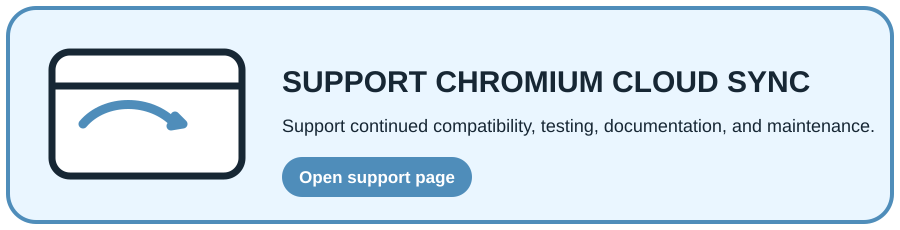

<div align="center">
  
  <h1>Chromium Cloud Sync</h1>
  <p><strong>Private, user-controlled synchronization for Chromium browsers.</strong></p>
  <p>Tabs · Tab Groups · Windows · Bookmarks · Extensions · History</p>
  <p>
    <a href="https://github.com/CYoJkoY/ChromiumCloudSync/releases"></a>
    <a href="https://github.com/CYoJkoY/ChromiumCloudSync/releases"></a>
    <a href="https://github.com/CYoJkoY/ChromiumCloudSync/actions/workflows/release.yml"></a>
    
    <a href="LICENSE"></a>
  </p>
  <p>
    <a href="#overview">Overview</a> ·
    <a href="#sync-scope">Sync scope</a> ·
    <a href="#security--encryption">Security</a> ·
    <a href="#extension-recovery">Extension recovery</a> ·
    <a href="#installation">Installation</a> ·
    <a href="#development">Development</a>
  </p>
</div>

> **Storage boundary:** synchronized browser state is stored in your private GitHub Gist. Optional extension package backups use a separate private GitHub repository or WebDAV backend.

##  Overview

**Chromium Cloud Sync** is a Manifest V3 extension for synchronizing useful Chromium browser state across devices without operating a project-owned cloud service.

The extension builds normalized snapshots locally, compares them with the remote state, merges compatible changes, preserves deletions, records conflicts, and verifies remote writes before accepting a synchronization result.

The project is designed for Chromium-family browsers that support the required extension APIs. Browser-native pages such as `chrome://` and other unsupported internal URLs are intentionally excluded from normal tab synchronization.

### Design goals

- **User-controlled storage** — your sync state lives in your own private GitHub Gist.
- **Local-first processing** — snapshot creation, comparison, merge decisions, and encryption happen inside the extension.
- **Safe synchronization** — updates are verified instead of assuming an upload succeeded.
- **Minimal trust boundary** — the project does not require a dedicated application backend for normal sync.
- **Recoverable state** — GitHub Gist revisions provide a natural history of the synchronized document.

##  Sync scope

| Data | Behavior |
| :--- | :--- |
| **Tabs & windows** | Synchronizes normal Chromium windows and HTTP(S) tabs while skipping unsupported browser-internal URLs. |
| **Tab Groups** | Preserves group title, color, collapsed state, and synchronization identity. |
| **Bookmarks** | Uses stable synchronization IDs instead of relying on local Chromium bookmark IDs. |
| **Extensions** | Synchronizes extension metadata, versions, install information, and missing-extension state. |
| **Sync metadata** | Stores revision, timestamps, device information, tombstones, conflicts, and related synchronization state. |

Third-party extension settings are intentionally **not** synchronized. Generic code cannot safely access another extension's isolated storage without depending on extension-specific APIs or implementation details.

##  Merge & conflict model

```text
                    Base snapshot
                         │
              ┌──────────┴──────────┐
              ▼                     ▼
         Local browser        Remote Gist
              │                     │
              └──────────┬──────────┘
                         ▼
                    Merge policy
                         │
             ┌───────────┴───────────┐
             ▼                       ▼
        Merged snapshot          Conflicts
```

Chromium Cloud Sync uses a three-way merge model:

1. **Base** — the common snapshot known before the current changes.
2. **Local** — the current browser state.
3. **Remote** — the state stored in the private Gist.

When both sides change different fields, the changes can be merged automatically. Policies are data-specific: timestamps are used for many mutable fields, extension versions can use the highest observed version, and fields such as bookmark or tab URLs can require an explicit conflict instead of silently choosing one side.

### Deletions

Deleted records are represented as **tombstones**. This prevents an old device from silently recreating an item that another device has intentionally removed.

### Remote-write verification

Synchronization does not stop at the HTTP upload. The remote state is read back and checked against the expected revision and snapshot checksum. A mismatch causes the synchronization flow to reconcile again instead of reporting a false success.

##  Security & encryption

Chromium Cloud Sync supports two encryption approaches:

### Convenience encryption

A key is derived from the current GitHub Token, so the user does not need to manage an additional recovery secret. This is intended for convenience and has a weaker isolation boundary because the GitHub Token participates in key derivation.

### Enhanced encryption

A separate recovery code is used to wrap the master key. The recovery code is never uploaded to GitHub, so possession of the GitHub Token alone is not sufficient to decrypt the encrypted sync payload.

### Key lifecycle

The settings UI provides lifecycle operations for updating the Token-derived wrapper, adding or replacing a recovery code, removing the convenience fallback, and rotating the master key. Master-key rotation re-encrypts the current synchronized state and history while keeping the same Gist.

> **Important:** encryption protects synchronized data stored by Chromium Cloud Sync. It does not make a compromised GitHub Token, compromised browser profile, or compromised endpoint harmless.

##  Device identity

Each browser can be assigned a human-readable **device name**, such as `Home PC`, `Work Laptop`, or `Gaming Browser`.

The device name is part of the synchronization identity model. This makes the device list understandable to humans and avoids relying solely on automatically generated local identifiers that can change between browser profiles or installations.

Device management also supports revocation of other authorized devices. Revocation prevents future synchronization from that device; it does not remotely erase data already cached on the device.

##  Extension recovery

Chromium Cloud Sync can compare the extension inventory recorded in the cloud snapshot with the extensions currently installed on the browser.

The **Extension Recovery** center can:

- detect extensions that are present in the cloud inventory but missing locally;
- show extension metadata and installation information;
- open a verified Chrome Web Store or Microsoft Edge Add-ons page when available;
- fall back to an extension homepage when no verified store link is available;
- copy an extension ID for manual lookup.

For extensions that cannot be obtained from a browser store, optional package recovery can use a separate private **GitHub repository** or **WebDAV** backend to store CRX / ZIP packages.

Installation itself remains a user-approved browser action. Chromium Cloud Sync does not silently install third-party extensions.

##  History, revisions & rollback

GitHub keeps the revision history of the synchronization Gist, so the project does not need to create a collection of extra history files just to support rollback.

The History page can inspect recorded revisions, show synchronization metadata, and use a previous revision as the new current state when the required recovery credentials are available.

The runtime also keeps a bounded synchronization history index and records unresolved conflicts separately from resolved or ignored conflicts.

##  Automatic synchronization

Automatic synchronization is **disabled by default**.

When enabled, the extension uses the configured interval together with browser events to trigger background synchronization. The default interval is 5 minutes, and the settings page exposes the interval controls.

This default avoids unexpected background network activity immediately after installation while still allowing users to opt into continuous synchronization.

##  Installation

### Recommended: release build

Stable users should install a published release from the project's [Releases](https://github.com/CYoJkoY/ChromiumCloudSync/releases) page.

Development builds are prereleases intended for testing and manual installation.

### From source

Executable source code is kept in **TypeScript** and compiled into the browser-loadable `dist/` directory. The repository root is therefore **not** the directory to load as an unpacked extension.

```bash
npm install
npm run build
```

Then:

1. Open `chrome://extensions/` or the equivalent Chromium extension management page.
2. Enable **Developer mode**.
3. Choose **Load unpacked**.
4. Select the generated `dist/` directory.

After changing any `.ts` source, rebuild before reloading the extension.

### First setup

Open **Chromium Cloud Sync → Settings** and:

1. enter a GitHub Token with access to your Gists;
2. validate the Token;
3. create a new sync Gist or bind an existing one;
4. choose the desired encryption mode;
5. assign a human-readable device name;
6. run an initial manual synchronization.

Automatic synchronization remains off until explicitly enabled.

##  Development

The project uses TypeScript for executable source and native HTML/CSS for the user interface. Generated browser JavaScript is produced in `dist/` and is intentionally excluded from source control.

Current package version: **1.8.1** with development identifier **1.8.1.dev3**.

### Commands

```bash
npm install
npm run typecheck
npm test
npm run build
npm run validate
npm run audit
npm run smoke
npm run build:zip
```

| Command | Purpose |
| :--- | :--- |
| `npm run typecheck` | Strict TypeScript checking for the shared runtime and domain layers. |
| `npm test` | Runs synchronization-core, invariants, schema, and storage tests. |
| `npm run build` | Builds the browser-loadable extension into `dist/`. |
| `npm run validate` | Runs version synchronization, type checking, tests, build validation, and audit checks. |
| `npm run audit` | Audits the final artifact for forbidden runtime constructs, unexpected permissions, remote scripts, source maps, and TypeScript files. |
| `npm run smoke` | Loads the built extension in Chromium and verifies the MV3 runtime path. |
| `npm run build:zip` | Builds the distributable ZIP package. |

The release pipeline also validates the final package contents before publication.

### Project structure

```text
.
├── src/
│   ├── runtime/        Sync engine, schema, storage, diagnostics, crypto
│   ├── features/       Extension storage and update features
│   └── ui/             Popup, settings, history, guide, recovery center
├── scripts/             Build, validation, test, smoke, and audit tooling
├── _locales/            English and Simplified Chinese UI resources
├── assets/readme/       README illustrations and documentation icons
├── manifest.json        Extension manifest and version source of truth
└── package.json         Development scripts and toolchain
```

### Versioning

`manifest.json` is the source of truth for the extension version. Development identifiers use `version_name` and do not change the stable package version stored in `package.json`.

Do not commit GitHub Tokens, WebDAV credentials, private Gist data, recovery codes, or signing keys.

<a href="https://cyojkoy.github.io/Payment/"></a>

Development support: **https://cyojkoy.github.io/Payment/**

## License

This project is licensed under the **MIT License**.

See [`LICENSE`](LICENSE) for the complete license text.
