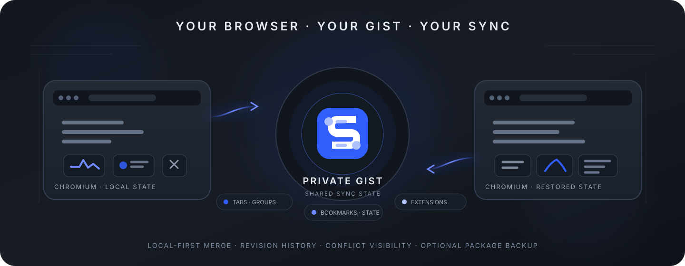
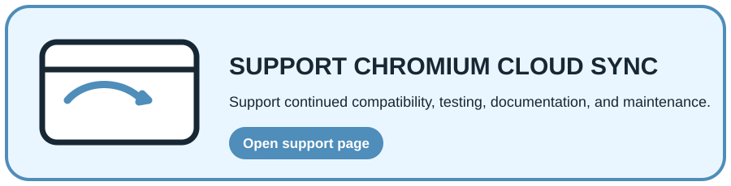

<div align="center">

<picture>
  
</picture>

<p>
  
  
  
  
</p>

<p><strong>Sync the browser state that Chromium browsers leave disconnected.</strong></p>

<p>
  <a href="#readme-overview">Overview</a> ·
  <a href="#readme-features">Features</a> ·
  <a href="#readme-providers">Cloud providers</a> ·
  <a href="#readme-storage-layout">Storage layout</a> ·
  <a href="#readme-gdrive-auth">Google Drive auth</a> ·
  <a href="#readme-sync-model">Sync model</a> ·
  <a href="#readme-data-scope">Data scope</a> ·
  <a href="#readme-extension-recovery">Extension recovery</a> ·
  <a href="#readme-package-backup">Package backup</a> ·
  <a href="#readme-security">Security</a> ·
  <a href="#readme-installation">Installation</a> ·
  <a href="#readme-usage">Usage</a> ·
  <a href="#readme-history">History</a> ·
  <a href="#readme-architecture">Architecture</a> ·
  <a href="#readme-development">Development</a> ·
  <a href="#readme-status">Status</a> ·
  <a href="#readme-support">Support</a> ·
  <a href="#readme-license">License</a>
</p>

</div>

---

<a name="readme-overview"></a>

##  Overview

**Chromium Cloud Sync** is a Manifest V3 browser extension for synchronizing Chromium browser state across devices through a selectable cloud provider, without depending on a browser vendor's built-in sync service.

The current implementation covers open windows and HTTP(S) tabs, tab groups, bookmarks, and installed third-party extension metadata. It also provides extension recovery and a separate CRX/ZIP package-backup path.

<a name="readme-features"></a>

##  Features

| Capability                    | Description                                                                                                           |
| :---------------------------- | :-------------------------------------------------------------------------------------------------------------------- |
| **Tabs & windows**            | Sync normal windows and HTTP(S) tabs, including title, URL, pinning, active state, order, and group information.      |
| **Tab groups**                | Preserve stable group identity, title, color, collapsed state, and group membership.                                  |
| **Bookmarks**                 | Sync bookmark titles, URLs, parent relationships, order, and stable IDs.                                              |
| **Extension inventory**       | Track third-party extension ID, name, version, enabled state, installation type, update information, and store links. |
| **Extension Recovery Center** | Detect missing extensions and surface available Chrome Web Store, Edge Add-ons, or compatible recovery links.         |
| **Three-way merge**           | Merge base, local, and remote snapshots instead of blindly replacing one side.                                        |
| **Deletion tombstones**       | Preserve deletions so stale devices do not silently recreate removed items.                                           |
| **Conflict visibility**       | Keep unresolved field conflicts explicit for review.                                                                  |
| **Provider-independent sync** | Run manual and automatic synchronization through the selected cloud provider.                                         |
| **Automatic sync**            | Optional background synchronization with configurable intervals; disabled by default.                                 |
| **History & rollback**        | Use provider-native history plus a local index of up to 30 recent entries where supported.                            |
| **Package backup**            | Store selected CRX/ZIP packages separately in a GitHub private repository, WebDAV, or Google Drive.                   |
| **Bilingual UI**              | English and Simplified Chinese interfaces.                                                                            |
| **Theme controls**            | Explicit theme controls for settings and auxiliary pages.                                                             |

<a name="readme-providers"></a>

##  Cloud providers

The synchronization engine is separated from the storage backend. Choose the provider that fits the environment:

| Provider         | What it stores                                   | Authentication / access                                     | History source                         |
| :--------------- | :----------------------------------------------- | :---------------------------------------------------------- | :------------------------------------- |
| **GitHub Gist**  | Modular sync files (see below) inside one Gist   | GitHub Token + private Gist                                 | Gist revision / commit history         |
| **Google Drive** | Modular sync files inside an application folder  | Browser-managed OAuth (Chromium Identity API); manual client only as a fallback | Google Drive file revisions            |
| **WebDAV**       | Modular sync files + a provider history index    | WebDAV URL, optional folder, username and password/app auth | `history/index.json`, up to 30 entries |

For GitHub Gist, the extension creates or binds a private Gist. Google Drive uses the `drive.file` scope and keeps its authorization state in the local browser profile. WebDAV requests require the user to grant access to the configured server origin.

<a name="readme-gdrive-auth"></a>

### Connecting Google Drive

Google Drive uses **browser-managed OAuth**, so connecting works like authorizing any other browser-integrated account:

1. Select **Google Drive** as the sync provider.
2. Click **Connect with Google account**.
3. Chromium's own identity/OAuth UI handles Google account selection and consent.
4. Only the minimum `https://www.googleapis.com/auth/drive.file` scope is requested — the extension can see files it created, nothing else.
5. The connection state is stored locally, and Settings shows the connected account, authorization mode, scope, and connection time.
6. **Disconnect** revokes the session and clears the cached token; reconnecting needs no credentials.

No OAuth Client ID or Client Secret is required for this flow, and access tokens are never written into synchronized data — every modular upload is checked for credential-shaped keys and rejected if any are found.

Where a browser genuinely cannot authorize the extension itself — an unpacked development build with no registered OAuth client, or a Chromium derivative without `identity.getAuthToken` — the extension detects that through capability probing, says so explicitly in Settings, and reveals an **Advanced: use your own OAuth client** section. That manual PKCE path is a documented fallback, not the default setup experience.

All three providers store the same set of independent module files — the provider only decides where those files live and how it versions them.

<a name="readme-storage-layout"></a>

### Cloud storage layout

Synchronized data is **not** one monolithic file. Each synchronized resource is stored independently so it can be uploaded, downloaded, and versioned on its own:

| File                 | Contents                                                                  |
| :------------------- | :------------------------------------------------------------------------ |
| `manifest.json`      | Storage layout, schema version, module index, legacy archive pointer       |
| `meta.json`          | Revisions, tombstone counts, migration record, orphan tombstones           |
| `extensions.json`    | Extension inventory module                                                 |
| `bookmarks.json`     | Bookmark collection module                                                 |
| `tabs.json`          | Windows, tabs, and tab groups module                                       |
| `history/index.json` | Provider history index where the provider has no native history            |

Metadata, schema information, and history indexes stay in separate files rather than being mixed into synchronized data, and a module file carries only its own payload plus its revision, timestamp, checksum, and tombstones.

Because only the modules whose data actually changed are uploaded, a bookmark edit re-writes `bookmarks.json` and the two control files while `extensions.json` and `tabs.json` stay byte-identical and keep their own module revision. Merging and conflict detection are module-scoped as well: a conflict is attributed to the module that owns it.

Settings → **Local** shows this layout live: the active layout, schema and storage-format versions, and every module file with its revision, deletion count, and checksum.

#### Upgrading from `current.json`

Existing cloud data is migrated automatically and non-destructively:

1. A remote that still holds `current.json` (or the older `chromium-cloud-sync.json`) is detected on the next read.
2. The legacy payload is validated, then split into the module files above, carrying its revision forward so module revisions stay continuous.
3. The migration is recorded in `meta.json` and `manifest.json` with the new storage layout and format version.
4. The legacy `current.json` is **kept** as a read-only archive — it is never deleted or reset by the migration, so the previous data remains recoverable.
5. If a device that has not upgraded yet writes a newer `current.json` afterwards, that newer payload wins and the migration record is re-created against it.
6. An incomplete module set is reported as an explicit error instead of being presented as a valid partial state.

Popup restore, cloud tab management, and history keep reading one coherent overall synchronization state — the split is a storage detail, not a user-facing concept.

<a name="readme-sync-model"></a>

##  Sync model

Chromium Cloud Sync uses a **local-first three-way merge** rather than a simple latest-device-wins strategy.

```text
              Local base snapshot
                       │
             ┌─────────┴─────────┐
             ▼                   ▼
       Current local        Current remote
             │                   │
             └─────────┬─────────┘
                       ▼
                Three-way merge
                 ┌─────┴─────┐
                 ▼           ▼
          auto-resolve    conflict
                 │           │
                 └─────┬─────┘
                       ▼
                New revision
```

The merge engine uses field-specific policies, including latest-value resolution for ordinary metadata, version comparison for extension versions, and manual conflicts when fields such as URLs are independently changed. Deletions are represented by tombstones.

The current cloud schema is **v11**, with migration support for schemas **7, 8, 9, 10 and 11**.

<a name="readme-data-scope"></a>

##  Data scope

### Synchronized

```text
Open windows
HTTP(S) tabs
Tab groups
Bookmarks
Third-party extension metadata
```

### Explicitly outside the sync snapshot

```text
Third-party extension private storage / settings
Browser passwords
Authentication credentials
Unrelated extension-private data
Browser-level settings
```

Third-party extension settings are intentionally excluded because a generic Chromium extension cannot safely read or write another extension's private storage.

<a name="readme-extension-recovery"></a>

##  Extension recovery

The extension inventory stores enough metadata to identify missing third-party extensions. The **Extension Recovery Center** can show extensions present in the cloud inventory but absent locally and provide direct store links when available.

When an official store link is unavailable or unsuitable for the current browser, the recovery flow can expose a third-party download/search path with an explicit warning. Installation remains an explicit browser action.

<a name="readme-package-backup"></a>

##  Third-party extension package backup

Package backup is deliberately separated from browser-state synchronization, and its backend is chosen independently of the sync provider.

```text
Browser state  →  selected cloud sync provider (Gist / Google Drive / WebDAV)
CRX / ZIP      →  GitHub private repository OR WebDAV OR Google Drive
```

You can back up packages to Google Drive while synchronizing browser state through GitHub Gist, or any other combination — selecting a package backend never changes the sync provider.

### Google Drive package backup

Packages are uploaded to an application-managed Drive folder, `Chromium Cloud Sync Packages`, which is deliberately **not** the synchronization folder, so package data can never be mixed into the browser-state payload. An optional subfolder organizes backups further.

- The Drive session authorized in sync settings is reused; there is no second authorization mechanism and no separate credential entry. Settings shows which Google account the package backup will use, and says so explicitly when Drive is not connected yet.
- Uploads use the resumable protocol with the content length declared up front, so large CRX/ZIP files stream instead of being base64-encoded and so quota exhaustion is reported before the bytes move.
- The package index (`index.json`), selection state (`selection.json`), and per-package metadata sidecars live inside the package destination, separate from the sync module files.
- Each backup record stores the filename, extension ID, extension version, source information (Chrome Web Store, Edge Add-ons, self-hosted update URL, unpacked, side-loaded, or policy), timestamp, size, and SHA-256 checksum, plus the backend that stored it.
- Backups are listed from Drive itself, not only from the index: a package uploaded from another profile or left behind by an interrupted index write is still listed (marked as unindexed), and an index entry whose file has disappeared is reported as missing and cannot be downloaded.
- Duplicate names and versions never silently overwrite an unrelated backup. When the same name and version already hold different bytes, the checksum prefix is folded into the file name so both packages survive; re-uploading identical bytes updates the existing entry instead of growing the index.
- Restore uses the existing package recovery flow — download streams the file back from Drive into the usual save dialog.
- Drive-specific failures are classified and surfaced distinctly in the package-backup UI: storage quota, rate limiting, expired authorization, insufficient permissions, missing files, upload size limits, and temporary Drive outages each produce their own message rather than a bare HTTP status.

The package subsystem keeps an index, selection state, package metadata, and SHA-256 checksums for every backend. The GitHub Contents API path rejects files larger than **95 MiB**; Drive and WebDAV stream the bytes and are bounded by the provider instead. The first backup requires manual selection of a CRX or ZIP because another extension's installed package bytes are not directly exposed to the extension.

<a name="readme-security"></a>

##  Privacy & security

New GitHub synchronization Gists are created as **private Gists**. The current synchronization payload is stored as normal JSON and is **not end-to-end encrypted**. Access to a configured sync backend can therefore expose the synchronized browser state.

For Google Drive, OAuth credentials are stored in `chrome.storage.local` and the implementation requests the `drive.file` scope. For WebDAV, the configured credentials are stored locally and requests use HTTP Basic Authentication.

The repository still contains compatibility handling for older encrypted synchronization data, but that is a migration path rather than the format used for new synchronization state.

Use least-privilege credentials. Package-backup credentials are separate from the main sync provider configuration and remain local to the browser.

<a name="readme-installation"></a>

##  Installation

Open [Releases](https://github.com/CYoJkoY/ChromiumCloudSync/releases) and download the latest ZIP or CRX.

For the ZIP:

1. Extract the archive.
2. Open `chrome://extensions` or your browser's equivalent extension page.
3. Enable **Developer mode**.
4. Select **Load unpacked**.
5. Choose the extracted directory.

The release workflow validates the version, runs tests and a Chromium smoke test, builds the ZIP, verifies its contents, creates a signed CRX3, generates SHA-256 checksums, and publishes all release artifacts.

### Initial configuration

Open **Settings** and configure the provider you want to use:

1. **GitHub Gist** — enter and validate a GitHub Token, then create or bind a private sync Gist.
2. **Google Drive** — enter your OAuth Client ID and complete the browser authorization flow.
3. **WebDAV** — enter the server URL and optional remote folder, credentials, then test the connection.
4. Run **Sync now** once.
5. Enable automatic synchronization when required.

<a name="readme-usage"></a>

##  Usage

The popup provides the operational status of the connection and synchronization state, including provider binding, last sync time, revision, conflict count, and automatic-sync state.

Automatic synchronization is **off by default** and uses **5 minutes** as its default interval. Available intervals are 5, 10, 15, 30, and 60 minutes.

<a name="readme-history"></a>

##  History & rollback

History is sourced from the active provider:

- GitHub Gist uses Gist revision/commit history.
- Google Drive uses file revisions.
- WebDAV maintains a `history/index.json` with up to 30 archived entries.

Rolling back creates a new current revision rather than destroying historical state.

<a name="readme-architecture"></a>

##  Architecture

```text
Chromium Cloud Sync
├── runtime/
│   ├── background.ts            orchestration + provider dispatch
│   ├── browser-capabilities.ts
│   ├── cloud-tab-state.ts       canonical cloud-tab projection
│   ├── diagnostics.ts
│   ├── legacy-crypto.ts
│   ├── schema.ts                validation + version migration
│   ├── storage.ts               serialized local mutations
│   ├── sync-core.ts             per-module merge, tombstones, checksums
│   ├── sync-modules.ts          modular storage domain (split/combine/migrate)
│   └── types.ts
├── cloud providers/
│   ├── cloud-files.ts           provider-agnostic FileStore protocol
│   ├── cloud-gist.ts            GitHub Gist transport
│   ├── cloud-gdrive.ts          Google Drive transport
│   └── cloud-webdav.ts          WebDAV transport
├── features/
│   ├── extension-storage.ts
│   ├── extension-storage-watch.ts
│   └── update.ts
└── ui/
    ├── popup / options / guide / history / extensions
    ├── i18n.ts
    ├── theme.ts
    └── styles/
```

The runtime layer coordinates browser APIs, local storage, provider dispatch, diagnostics, schema migration, and synchronization. `sync-core.ts` contains per-module merge and tombstone logic; `sync-modules.ts` owns the modular storage layout (module split/combine, per-module revisions and change detection, legacy migration); `schema.ts` validates and migrates cloud state.

`cloud-files.ts` defines one provider-agnostic file protocol — read, write, remove, list, and history — and each provider module implements only file placement, transport, and its native history model. Adding a provider therefore does not require touching merge, migration, or history semantics, and no provider needs to know how another one stores files. The UI layer provides the operational surfaces.

<a name="readme-development"></a>

##  Development

### Requirements

- Node.js 24
- npm
- TypeScript
- Playwright with Chromium

Runtime source is maintained in TypeScript. The release workflow rejects tracked `.js` source files and generates JavaScript during the build.

### Common commands

```bash
npm install
npm run typecheck
npm test
npm run validate
npm run build:zip
npm run smoke
```

### Release workflow

```text
Git tag
   │
   ├─ version validation
   ├─ TypeScript validation
   ├─ unit / invariant / schema / storage tests
   ├─ Playwright browser smoke test
   ├─ ZIP build
   ├─ ZIP contents verification
   ├─ signed CRX3 build
   ├─ SHA-256 checksums
   └─ GitHub Release
```

Stable tags use `vX.Y.Z` and are published as normal GitHub Releases. ChromiumCloudSync uses a single stable release channel; `version_name`, `.devN` tags, and pre-releases are not used.

<a name="readme-status"></a>

##  Project status & roadmap

The current core is browser-state synchronization, extension inventory/recovery, and separate package backup through a pluggable cloud-provider layer.

Current providers are GitHub Gist, Google Drive, and WebDAV.

Future work is expected to expand browser-state coverage carefully. **Extension settings** and **browser settings** are roadmap items, not synchronized data in the current release.

<a name="readme-support"></a>

##  Support

Support helps fund compatibility testing, synchronization reliability work, documentation, and continued maintenance.

[Open the Chromium Cloud Sync support page](https://cyojkoy.github.io/Payment/)

<a href="https://cyojkoy.github.io/Payment/"></a>

Use [GitHub Issues](https://github.com/CYoJkoY/ChromiumCloudSync/issues) for bugs, compatibility problems, synchronization conflicts, schema issues, and feature requests.

Never include GitHub Tokens, private credentials, or sensitive Gist contents in an issue.

<a name="readme-license"></a>

##  License

Chromium Cloud Sync is released under the **MIT License**. See [`LICENSE`](LICENSE) for the full license text.

<div align="center">

[](https://github.com/CYoJkoY/ChromiumCloudSync)

</div>
